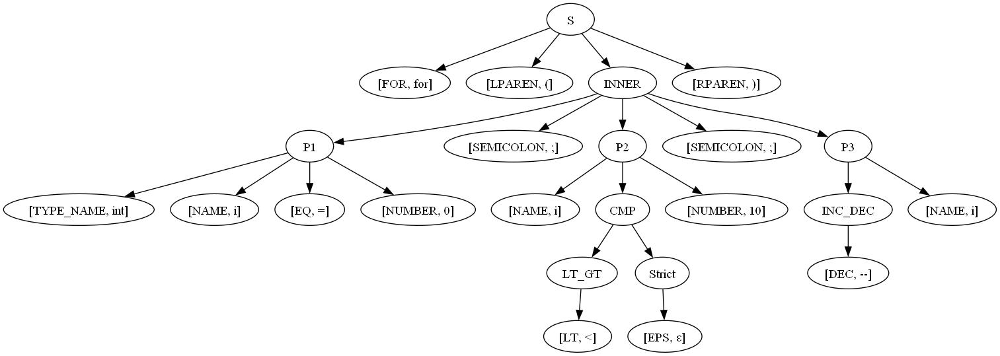

# Отчет по лабораторной работе № 2

**Вариант 12.** Оператор `for` в Си

Оператор начинается ключевым словом ***“for”***, далее в скобках три параметра, разделенные точкой
с запятой. Первый параметр: имя типа, имя переменной, начальное значение. Второй параметр: имя переменной, знак сравнения, число. Третий
параметр: имя переменной, операция инкремента/декремента.
Используйте один терминал для всех имен переменных и имен типов.
Используйте один терминал для ключевого слова ***for*** (не несколько ***‘f’***,
***‘o’***, ***‘r’***). Используйте один терминал для оператора ***++*** (не два плюса).

**Пример:**
```for (int x = 0; x < 10; x++)```

## Run Instruction
**ensure, you have sbt**
```
// build graph for expression; 
// result will be written to ./src/main/scala/out/graph.dot.png
sbt run
// next, in the shell, something like "Input expression:" should appear
input the for-operator expression and view the result   

// tests
sbt test
```

## Grammar development
### Transformed grammar
```
S -> FOR(INNER)
INNER -> P1;P2;P3
P1 -> TYPE_NAME NAME EQ NUMBER
P2 -> NAME CMP NUMBER
P3 -> NAME INC_DEC
CMP -> LT_GT STRICT
LT_GT -> LT | GT
STRICT -> EPS | EQ
INC_DEC -> INC | DEC
```

## Lexical analyzer
| **NonTerminal** | **Description**                        |
|-----------------|----------------------------------------|
| **S**           | Start non-terminal                     |
| **INNER**       | Parameters, separated by semicolon     |
| **P1**          | First parameter                        |
| **P2**          | Second parameter                       |
| **P3**          | Third parameter                        |
| **CMP**         | Comparison                             |
| **LT_GT**       | Comparison operator                    |
| **STRICT**      | Indicator of the comparison strictness |
| **INC_DEC**     | Increment/decrement operation          |


## Syntax analyzer
| **Terminal**  | **Токен** |
|---------------|-----------|
| **(**         | LPAREN    |
| **)**         | RPAREN    |
| **;**         | SEMICOLON |
| **for**       | FOR       |
| ++            | INC       |
| --            | DEC       |
| =             | EQ        |
| <             | LT        |
| `>            | GT        |
| **type name** | TYPE_NAME |
| **name**      | NAME      |
| **number**    | VALUE     |
| **` `**       | EPS       |
| $             | END       |

## FIRST & FOLLOW
| **NonTerminal** | **FIRST** | **FOLLOW** |
|-----------------|-----------|------------|
| **S**           | FOR       | END        |
| **INNER**       | TYPE_NAME | RPAREN     |
| **P1**          | TYPE_NAME | SEMICOLON  |
| **P2**          | NAME      | SEMICOLON  |
| **P3**          | NAME      | RPAREN     |
| **CMP**         | LT, GT    | NUMBER     |
| **LT_GT**       | LT, GT    | EPS, EQ    |
| **STRICT**      | EQ, EPS   | NUMBER     |
| **INC_DEC**     | INC, DEC  | RPAREN     |

## Parse tree
```
for(int32 var_naMe = -987654321; var_naMe <= 123456789; var_naMe++)
```


## Fast links
- [Tests](./src/test/scala/ParserSpec.scala)
- [Tokens](./src/main/scala/grammar_entry/Token.scala)
- [Grammar structure](./src/main/scala/util/Constants.scala) *`#derivations`*
